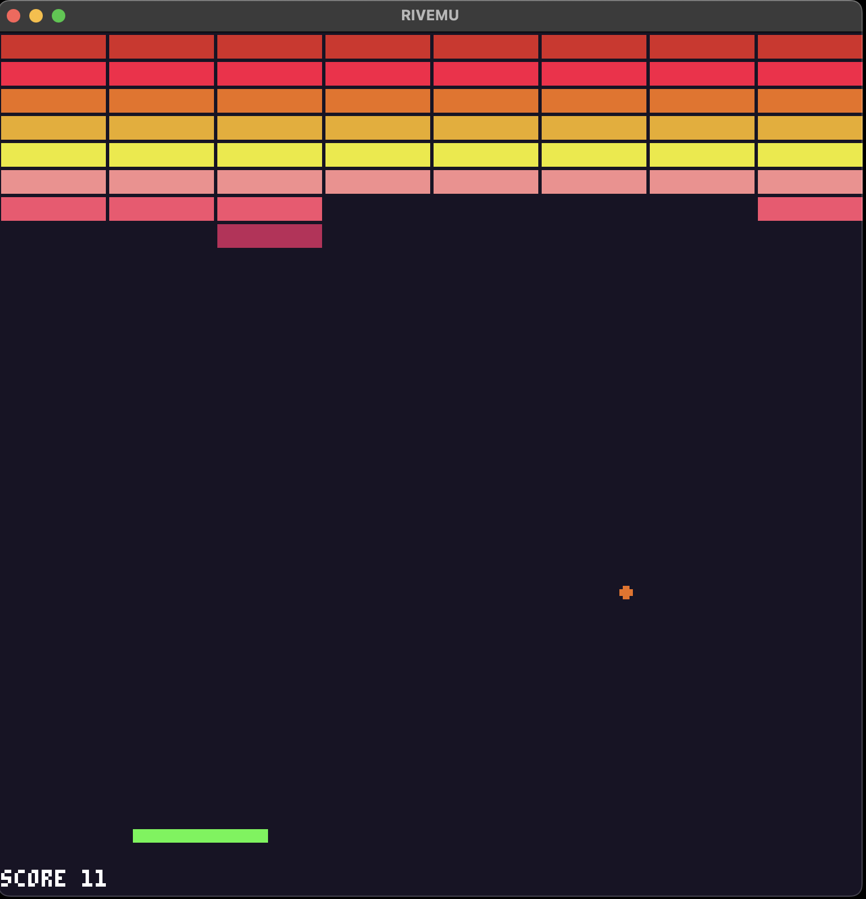

# Breakout

This is the classic [breakout](<https://en.wikipedia.org/wiki/Breakout_(video_game)>).



Submitted to the first [Rives Game Jam](https://itch.io/jam/rives1).

```shell
rivemu -workspace -exec riv-jit-c breakout.c
```

## Possible improvements

- bouncing algorithm is over simplified, only working for speed 1, and only with 45 degrees angles;
- bouncing off paddle should change angle depending on hit horizontal position;
- decay score over time;
- different brick layouts;
- power ups and power downs that change paddle size and/or ball speed;
- background music;
